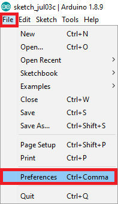
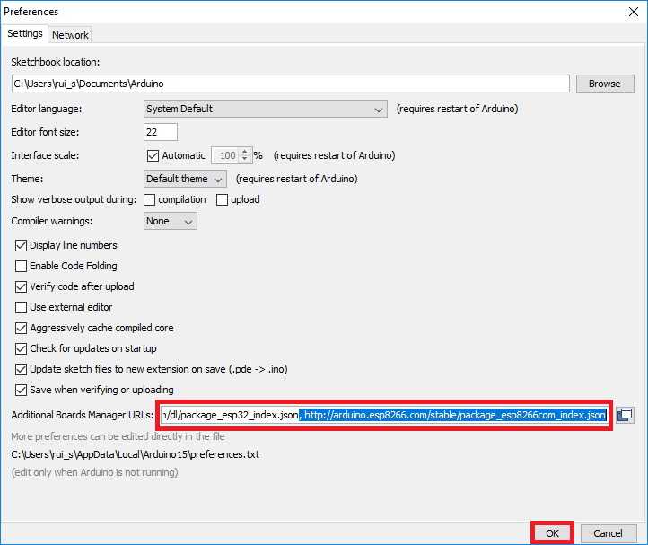
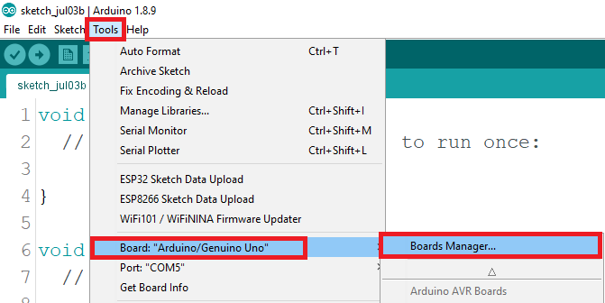
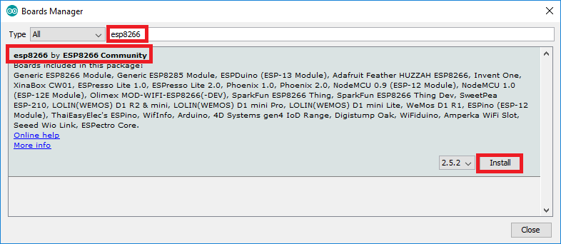

### Installing ESP8266 & ESP32 Boards
* In your Arduino IDE, go to File> Preferences (Ctrl+Comma)  
  
* Enter `https://dl.espressif.com/dl/package_esp32_index.json, http://arduino.esp8266.com/stable/package_esp8266com_index.json` into the "Additional Boards Manager URLs" field . Then, click the "OK" button  
  
* Open the Boards Manager. Go to Tools > Board > Boards Manager… 
  
* Search for ESP8266 and press install button for the "ESP8266 by ESP8266 Community": 
  

### Arduino Libraries used:
* Espalexa (tested 2.7.0) : https://github.com/Aircoookie/Espalexa